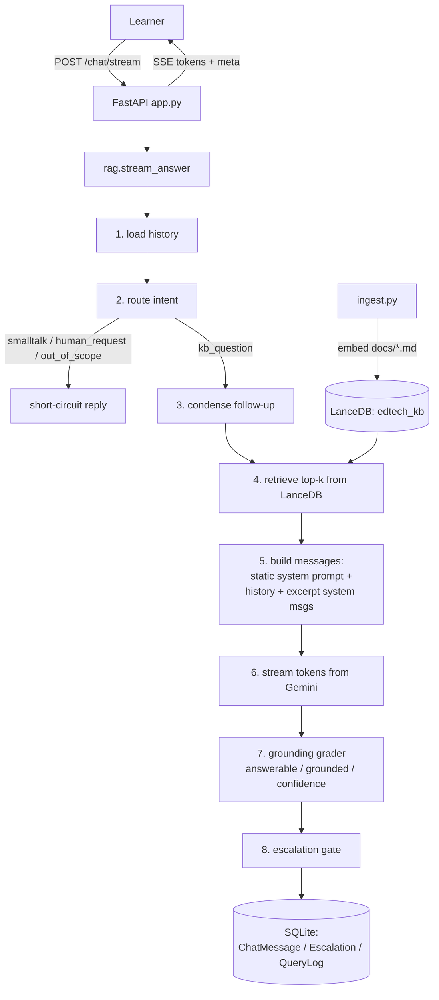

# Converse — LearnForge Support Assistant

A retrieval-augmented support assistant for **LearnForge**, an ed-tech platform. Answers learner questions from the internal knowledge base (FAQs, policies, past tickets), stays grounded in retrieved excerpts, handles multi-turn chats, and escalates to a human when unsure.

---

## Stack

| Layer | Choice |
|---|---|
| LLM | Google Gemini (free tier) |
| Embeddings | Google `text-embedding-004` |
| Vector store | LanceDB (local, hybrid + RRF) |
| API | FastAPI + Uvicorn |
| Chat UI | Chainlit (mounted at `/chat-ui`) |
| Persistence | SQLite via SQLModel |

---

## Architecture



Key design points:

- **Static system prompt** (byte-identical every call → cacheable prefix). Retrieved excerpts are appended as *separate* system messages with `[n] source=... last_reviewed=...` headers, so the model cites them inline.
- **Intent router before retrieval.** Greetings, thanks, out-of-scope, and "talk to a human" skip the KB pipeline entirely — this is why "hello" no longer escalates.
- **LLM grounding grader, not retrieval scores.** LanceDB returns RRF ranks (`1.000, 0.667, …`), which aren't similarities. A separate grader call returns calibrated `{answerable, grounded, confidence}` and drives escalation.

---

## Setup

Requires Python 3.10+ and a free Gemini key from https://aistudio.google.com/apikey.

```bash
git clone <this-repo> && cd converse
python -m venv .venv && source .venv/bin/activate

make install            # pip install -r requirements.txt
cp .env.example .env    # paste GEMINI_API_KEY into .env

make ingest             # build the LanceDB index from ./docs
make dev                # start uvicorn with reload on :8000
```

Open the chat at **http://localhost:8000/chat-ui** (Swagger at `/docs`).

### Make targets

| Target | Effect |
|---|---|
| `make install` | Install Python deps |
| `make ingest` | Rebuild the LanceDB index from `./docs` |
| `make run` | Start uvicorn (no reload) |
| `make dev` | Start uvicorn with `--reload` |
| `make smoke` | POST one sample question to `/chat` and pretty-print JSON |
| `make clean` | Remove `./lancedb`, `./storage`, `./converse.db` |

Full reset: `make clean && make ingest && make dev`.

---

## Usage

Try these in the chat UI to exercise each branch:

| Message | What it shows |
|---|---|
| `hello` | smalltalk route — no retrieval, no escalation |
| `Can I get a refund for a course I bought 3 days ago?` | grounded answer with `[n]` citations |
| `What about a subscription renewal?` | multi-turn condense → standalone query |
| `I want to talk to a human` | `user_requested` escalation |
| `What's the weather in Berlin?` | `out_of_scope` handling |

CLI equivalent:

```bash
make smoke
```

Observability:

```bash
curl -s http://localhost:8000/evals/summary     | python -m json.tool
curl -s http://localhost:8000/escalations       | python -m json.tool
curl -s http://localhost:8000/sessions/smoke/messages | python -m json.tool
```

---

## Data schema

**SQLite (SQLModel, `db.py`)**

```
ChatMessage   id, session_id*, role, content, created_at
Escalation    id, session_id*, reason, confidence, created_at
QueryLog      id, session_id*, query, answer, confidence,
              sources (JSON), escalated, latency_ms, created_at
```

`*` = indexed. One `QueryLog` row per assistant turn is the eval substrate.

**LanceDB (`edtech_kb` table)**

```
{ id, vector[768], text, file_name, last_reviewed }
```

`last_reviewed` is parsed from each doc's footer at ingest time (e.g. `"February 2026"`). It's the honest staleness signal — the original substring heuristic flagged chunks that *warn about* outdated policies, exactly backwards.

---

## Failure handling

| Failure | Mitigation |
|---|---|
| Low-confidence answer | Grader `confidence < 0.6` → escalate `low_confidence` |
| Hallucination | Grader re-checks draft against excerpts; `grounded:false` → `ungrounded` |
| Empty / bad retrieval | `no_docs` escalation (no invented answer) |
| Stale / superseded policy | Prefer newest `last_reviewed`; treat "outdated" passages as historical |
| Generation error | `generation_error` — apology + handoff |
| Out-of-scope | Routed, explain scope, offer human |
| User asks for human | Regex + router, deterministic short-circuit |
| Grader / router JSON parse fail | Safe fallbacks (`confidence=0.5`, `kb_question`) |

---

## Eval plan

Substrate: every turn is logged in `QueryLog`. Plan:

**Offline set** — ~40 golden Q/A pairs from `docs/`, each tagged with the gold source file. Metrics:

| Metric | Target |
|---|---|
| Retrieval hit rate @4 (gold source in top-4) | ≥ 0.9 |
| Grounded rate (non-escalated answers) | ≥ 0.95 |
| Hallucination rate (ungrounded **and** not escalated) | < 0.02 |
| Citation validity (`[n]` maps to a real excerpt) | 1.0 |
| False-escalation rate on answerable questions | < 0.05 |
| Refusal accuracy on unanswerable questions | ≥ 0.9 |
| Multi-turn correctness (two-turn scripts) | ≥ 0.85 |
| P95 latency | < 4s |

**Online** — `GET /evals/summary` reports `escalation_rate`, `avg_confidence`, `p50/p95` live. Watch escalation-rate spikes (retrieval or model regression) and `ungrounded` rate (drift indicator). Every escalated turn is a labeled failure worth weekly triage into new KB content.

**Regression** — any prompt / chunker / model change re-runs the offline set; the metric diff is the review artifact.

---

## Trade-offs

- **LanceDB + RRF over Pinecone + cross-encoder.** Embedded, file-based, zero-ops — makes the prototype runnable in 5 minutes. A cross-encoder reranker would lift precision on ambiguous policy questions for ~80ms more latency; that's the first upgrade.
- **Two LLM calls (generate + grade) over one.** Independent judge → cleaner hallucination signal and a per-turn `reason` audit trail, at ~300–500ms cost. Self-reported confidence in one call would be cheaper but couples answerer and judge.
- **SQLite over Postgres.** Same schema you'd ship; port is a `create_engine` swap. Right call for a take-home.
- **Static prompt + excerpt system messages.** Cacheable prefix; unambiguous citations.
- **Router before retrieval.** Fixes the "hello escalates" bug without weakening the gate. Optional regex short-circuit skips the LLM call for bare greetings.

With more time: offline eval harness (biggest gap), cross-encoder reranking, escalation→KB triage loop, tenant-scoped retrieval, semantic caching, OTel traces.

---

## Known limitations

- Static KB snapshot; re-run `make ingest` after editing `docs/`.
- Grader is itself an LLM — strong signal, not ground truth. The offline set calibrates it.
- `QueryLog.sources` stores excerpt text inline; production would normalize to a `Chunk` table.
- Single-worker assumption (SQLite file lock); multi-worker needs Postgres or WAL + pool.
- Prompt-extraction is mitigated by instruction, not solved.

---

## Layout

```
converse/
├── docs/            faqs.md · policies.md · tickets.md
├── app.py           FastAPI + Chainlit mount
├── db.py            SQLModel tables + engine
├── ingest.py        build LanceDB index
├── rag.py           retrieve → generate → grade → gate
├── ui.py            Chainlit chat surface
├── Makefile
├── requirements.txt
└── .env.example
```