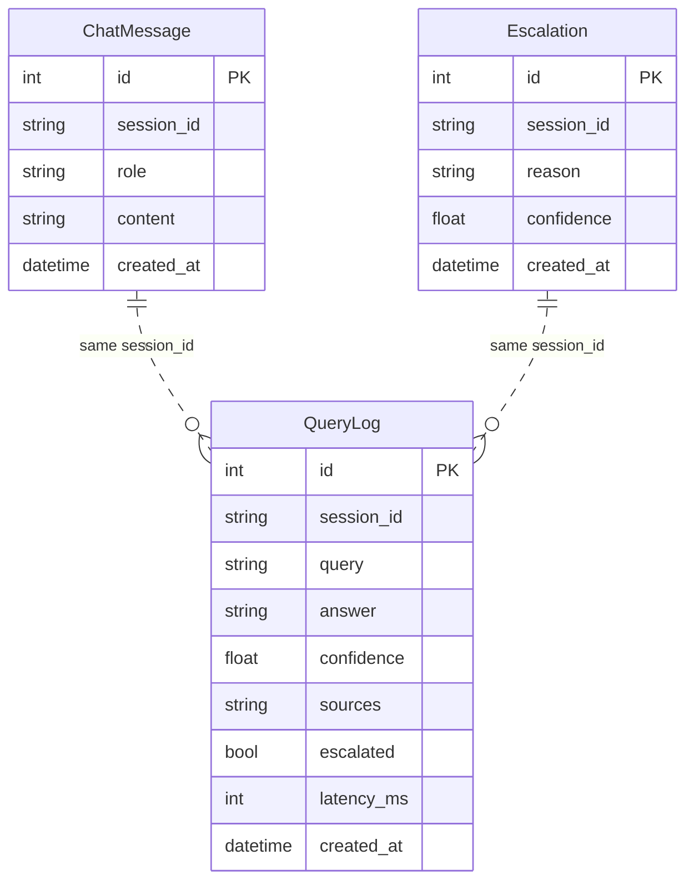
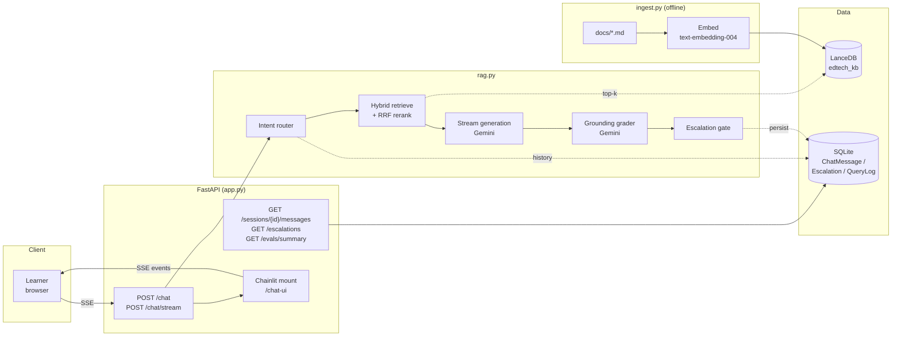
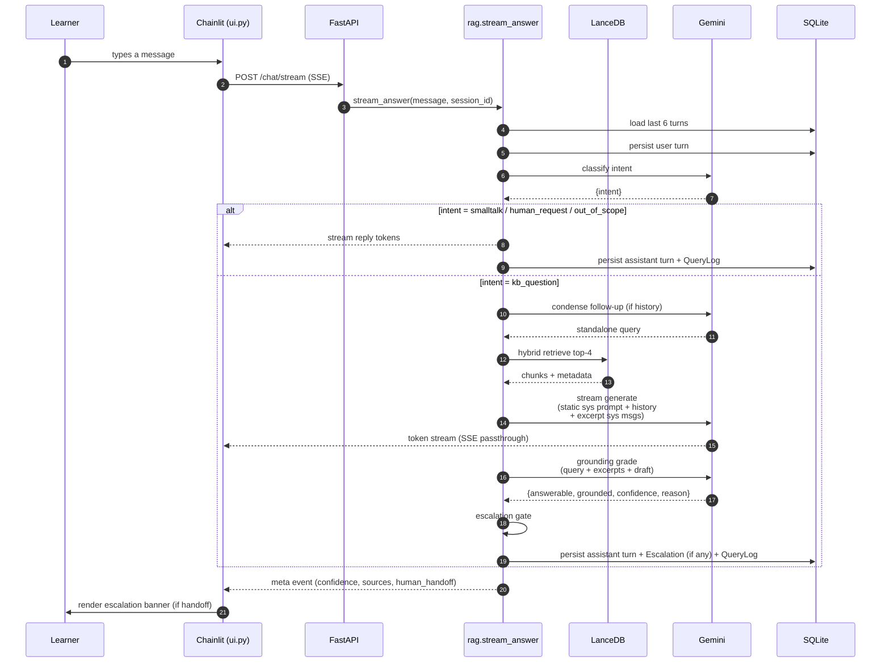
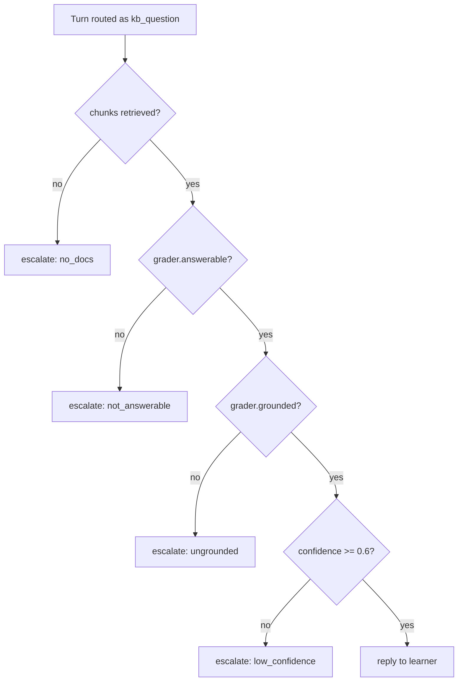
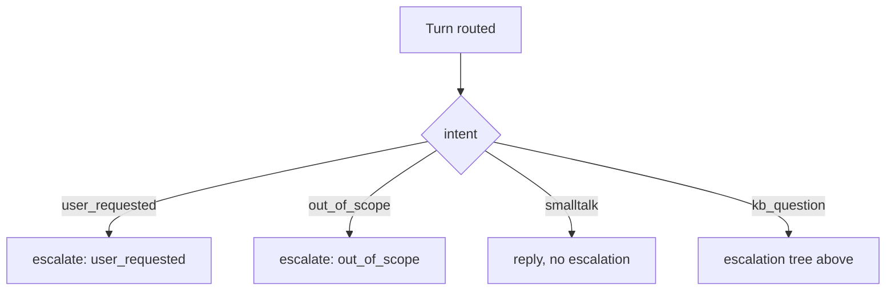

# Converse — Data Schema & System Design

## 1. Data Schema

Three storage layers: the **vector store** (retrieval), **SQLite** (conversation + ops + eval logs), and the **raw docs** (source of truth for re-ingest).

### 1.1 Vector store — LanceDB table `edtech_kb`

One row per chunk. Written by `ingest.py`, read by `rag._retrieve`.

| Field | Type | Source | Notes |
|---|---|---|---|
| `id` | string | LlamaIndex | Stable chunk id |
| `vector` | float[768] | `text-embedding-004` | Embedding of `text` |
| `text` | string | chunker output | The chunk the LLM sees |
| `file_name` | string | doc metadata | `faqs.md` / `policies.md` / `tickets.md` |
| `last_reviewed` | string \| null | parsed from doc footer | e.g. `"February 2026"`; null if absent |

**Why these fields:**

- `file_name` is the citation surface (`[1] source=faqs.md`). Kept as a plain string rather than a joined table because the corpus is 3 files — a foreign key would be ceremony without benefit.
- `last_reviewed` is parsed at ingest time from footer patterns like `Last reviewed: February 2026.` The corpus deliberately contains superseded policies; the prompt tells the model to prefer the newest date and treat "outdated" passages as historical. Parsing the date is the honest staleness signal — the earlier substring heuristic (`"outdated" in text`) flagged the exact chunks that *warn about* stale policies.
- **No `tenant_id` in the prototype.** The corpus is single-tenant. Multi-tenant is a field + a filter in `_retrieve`; called out in trade-offs.

**Index config:** `query_type="hybrid"` (vector + FTS) with `RRFReranker`. Hybrid beats pure-vector on policy/keyword questions ("14 days", "cancel", "refund").

### 1.2 Relational store — SQLite via SQLModel (`db.py`)

Three tables. Every assistant turn writes to all of them (or two of them if no escalation).



`session_id` is the join key — a chat thread is one `session_id` across all three tables. No hard foreign keys; the tables are independent streams that share the identifier so any of them can be written without ordering constraints.

**`ChatMessage`** — the conversation log. One row per turn.

| Column | Purpose |
|---|---|
| `session_id` (indexed) | Thread id, supplied by the client (`cl.context.session.id` from Chainlit) |
| `role` | `"user"` or `"assistant"` |
| `content` | Raw text |
| `created_at` | Ordering key for `_load_history` (last 6 turns) |

**`Escalation`** — one row per handoff. Separate from `QueryLog` because ops needs a fast "what's queued for a human?" query without scanning all turns.

| `reason` value | Trigger |
|---|---|
| `user_requested` | Regex + router matched "talk to a human" |
| `no_docs` | Retrieval returned zero chunks |
| `not_answerable` | Grader: `answerable=false` |
| `ungrounded` | Grader: `grounded=false` |
| `low_confidence` | Grader: `confidence < 0.6` |
| `out_of_scope` | Router classified as non-LearnForge |
| `generation_error` | LLM call raised |

**`QueryLog`** — one row per assistant turn. The eval substrate; every metric in the eval plan is computed from this table.

| Column | Purpose |
|---|---|
| `query` | The user's raw message (pre-condense) |
| `answer` | Final assistant text |
| `confidence` | Grader's 0–1 score |
| `sources` | JSON-serialized excerpt list (`[{source, last_reviewed, score, content}, …]`) |
| `escalated` | Boolean; the primary signal for `escalation_rate` |
| `latency_ms` | End-to-end, per turn |

**Why store `sources` inline as JSON** — it makes every turn self-contained for debugging and eval export without a join. Production would normalize: a `Chunk` table with a stable id, and a `QueryLogChunk` join table keyed on `(query_log_id, chunk_id, rank)`. Prototype cuts that corner deliberately.

### 1.3 Raw docs (`docs/*.md`)

Markdown files, chunked by LlamaIndex's `SimpleDirectoryReader`. No front-matter — metadata (`file_name`) comes from the filesystem and `last_reviewed` is parsed from a footer line. This keeps the source readable to a human reviewer and makes ingest a pure function of the filesystem.

```
docs/
├── faqs.md        15 FAQ entries
├── policies.md    10 policy excerpts
└── tickets.md     15 past ticket transcripts
```

Re-ingest after edits: `make ingest`. No versioning, no TTL, no watcher — deliberate for the prototype.

---

## 2. System Design

### 2.1 High-level architecture



Three containers, cleanly separated:

- **API** — request/response, SSE, Chainlit mount. No RAG logic. Talks to `rag` and `db`.
- **Core (`rag.py`)** — the retrieval + generation + grading loop. Pure functions of `(message, session_id)`, no HTTP.
- **Data** — LanceDB for retrieval, SQLite for conversation + ops + eval logs.
- **Offline (`ingest.py`)** — one-shot index build from `docs/`. Never runs in the request path.

### 2.2 End-to-end query flow



### 2.3 Request payload construction

The single most important implementation detail: how the LLM's context window is assembled.

```
[ system   ] STATIC_SYSTEM_PROMPT           ← byte-identical every call (cacheable)
[ user     ] turn 1
[ assistant] turn 1
[ user     ] turn 2
[ assistant] turn 2
[ system   ] Retrieved excerpt [1] source=faqs.md, last_reviewed=null
             <chunk text>
[ system   ] Retrieved excerpt [2] source=policies.md, last_reviewed=January 2026
             <chunk text>
...
[ user     ] <current user turn>
```

- **Static prompt is byte-identical across every request** → cacheable prefix on Gemini (and Anthropic/OpenAI). No per-query interpolation.
- **Excerpts are separate system messages**, not concatenated into the user turn, so inline `[n]` citations are unambiguous and each excerpt carries its own `source` + `last_reviewed` header.
- **History sits between the static prompt and the excerpts** so the stable prefix is still maximal.

### 2.4 Escalation decision tree



Non-KB intents bypass this tree entirely:



**Why the grader and not retrieval scores:** LanceDB `query_type="hybrid"` returns RRF rank-fusion positions (`1.000, 0.667, 0.333, 0.000`), which are position indicators, not similarities. A `max_score < 0.75` gate — the original prototype's approach — fires on every query because the top hit is always `1.000`. The grader returns a calibrated 0–1 `confidence` plus explicit `answerable` / `grounded` booleans, which is the signal the gate actually needs.

### 2.5 Failure modes and where they're handled

| Failure | Handled at | Response |
|---|---|---|
| Retrieval empty | `_decide_escalation` | `no_docs` escalation |
| Grader: not answerable | `_decide_escalation` | `not_answerable` escalation |
| Grader: ungrounded claim | `_decide_escalation` | `ungrounded` escalation |
| Grader: low confidence | `_decide_escalation` | `low_confidence` escalation |
| Grader JSON parse fail | `_grade` | Fallback to `confidence=0.5`, no crash |
| Router JSON parse fail | `_route` | Fallback to `kb_question` (safe path) |
| LLM generation error | `stream_answer` | Apology + `generation_error` handoff |
| Stale / superseded policy | prompt + `last_reviewed` metadata | Prefer newest date, note older guidance |
| Follow-up with no context | `_condense_query` | Rewrite using last 6 turns; fall back to raw message on error |

Every failure path writes a `QueryLog` row. Nothing is silent.

---

## Summary

- **Vector store:** one LanceDB table, four payload fields, `last_reviewed` as the staleness signal.
- **Relational store:** three SQLite tables sharing `session_id`; `QueryLog` is the eval substrate.
- **Architecture:** FastAPI (transport) / `rag.py` (loop) / LanceDB + SQLite (state) / `ingest.py` (offline).
- **Query flow:** route → condense → retrieve → generate → grade → gate → persist.
- **Escalation:** LLM grader drives the gate; non-KB intents short-circuit before retrieval.